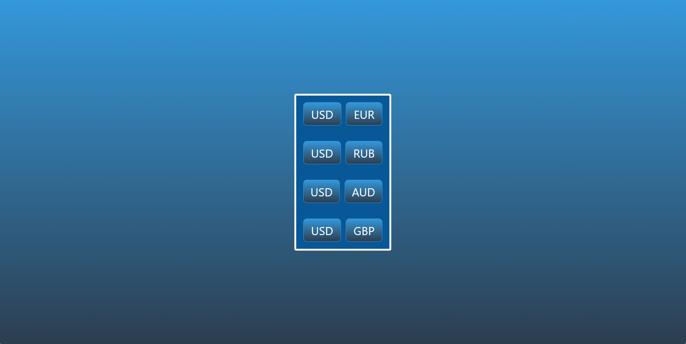
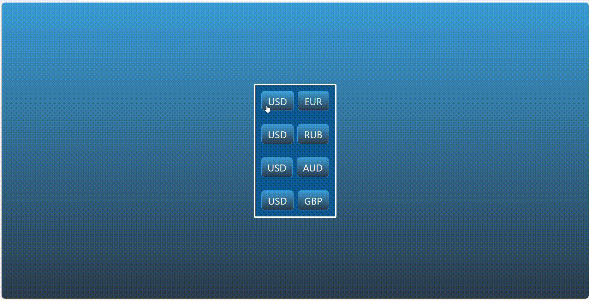

# Приложение для сравнения курсов валют

Приложение сравнивает курсы выбранных валют и выводит gif-изображение в зависимости от соотношения.
Если курс повысился, то выводится изображение по тэгу "rich", если понизился - по тэгу "broke".

## Иллюстрация

Ниже приведена иллюстрация интерфейса и гиф-изображения.




## Предварительные требования

- [Docker](https://www.docker.com/get-started/)
- [NodeJS](https://nodejs.org/en/download)

## Скрипты
```bash
$ npm run get:dependencies #(установка зависимостей фронтенда, бэкенда)
$ npm run build #(сборка и компиляция фронтенда и бэкенда)
$ npm run start:backend #(запуск бэкенда)
$ npm run start:frontend #(запуск фронтенда)
$ npm run docker-compose-up #(запуск контейнера с MongoDB)
$ npm run docker-compose-down #(выключение контейнера с MongoDB)
$ npm run wait-on-db #(скрипт, ожидающий запуска контейнера)
$ npm run start:first #(скрипт для первого запуска: запускает контейнер, бэкенд и фронтэнд при наличии зависимостей и собранного бэкенда и фронтенда)
$ npm run start #(скрипт для запуска при включенном контейнере, наличии зависимостей и сборки. запускает бэкенд и фронтенд)
```

## Установка и запуск

1. Клонируйте репозиторий 
    ```bash
        git clone https://github.com/Spfeed/web-mikhalich.git
    ```
2. Перейдите в директорию проекта и установите зависимости
    ```bash
        $ npm run get:dependencies
    ```
3. Осуществите сборку проекта:
    ```bash
        $ npm run build
    ```
4. Запустите проект:
    ```bash
        $ npm run start:first
    ```
5. Если у вас уже работает контейнер, то воспользуйтесь следующей командой запуска:
    ```bash
        $ npm run start
    ```